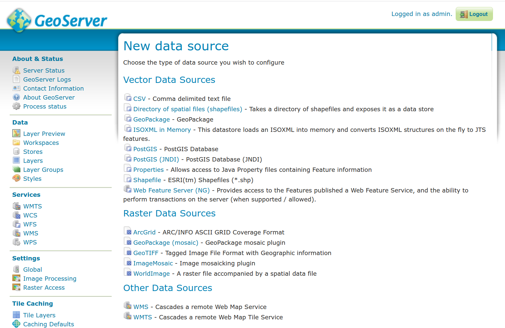

# geoserver-iso-11783-part-10

This project contains a build for geoserver. It depends on the following two projects:

 * https://github.com/ManuelB/jaxb-iso-11783-part-10
 * https://github.com/ManuelB/geo-tools-iso-11783-part-10

```
git clone --recurse-submodules https://github.com/ManuelB/geoserver-iso-11783-part-10.git
cd geoserver-iso-11783-part-10
mvn install
cd geoserver 
mvn jetty:run
# go to http://localhost:8080/web/
# Username: admin Password: geoserver
# You will find the ISOXML plugin under:
# Stores -> Add new Store -> ISOXML in Memory
```

For enabling cors, using the same workspace all the time, JWT token checking and auto configuration based on requests you can use the tomcat-cors-security profile.

```
mvn -P tomcat-cors-security install
```


